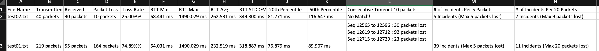

## Introduction

A tool to analyze ping output:  
1. Pakcets Counts & Round-Trip Time:
    a. # of packets transmitted 
    b. # of packets received
    c. # of packets lost
    d. % of packets loss
    e. RTT min
    f. RTT avg
    g. RTT max
    h. RTT stddev (standard deviation)
2. Percentile Calculation 
    a. Constraints: 
        Input one or more integers between 0-100
3. Consecutive Timeouts
    a. Notice:
        a1. Exclude the timed-out packets that occur before the 1st successful ping packet. 
            (As in test02.txt, ignore timeouts before line 7.)
        a2. Exclude the timed-out packets that occur after the last successful ping packet. 
            (As in test02.txt, ignore timeouts before line 46.)
    b. Constraints: 
        Input one integer
4. Lost-Packets during a Time-Period (How many packets were lost during the requested time period?)
    a. Constraints: 
        a1. Input one or more integer values
        a2. The minimum value for the duration of time should be at least 1.
        a3. The maximum value for the duration of time would be the max packets of the input file.
5. Output to output.csv file by default
    a. For Lost-Packet during a Time-Period section, it would only include:
        a1. The number of incidents that happened 
        a2. The max number for the lost packets

## Instruction

1. Install requirement

```console
% pip3 install -r requirements.txt
```


2. Run As:

a. Help:

```console
% python3 ping_statistics.py -h                                                  
usage: ping_statistics.py [-h] [-p PERCENTILES] [-t TIMEOUT] [-c COUNT] [-o OUTPUT] filenames

Ping Statistics

positional arguments:
  filenames             List the files that contain(s) ping outputs, sepearted by ','

optional arguments:
  -h, --help            show this help message and exit
  -p PERCENTILES, --percentiles PERCENTILES
                        List percentile value(s) (0-100), sepearted by ','
  -t TIMEOUT, --timeout TIMEOUT
                        Enter an Integer for the MAX Consecutive Timeout Packet(s)/Second(s)
  -c COUNT, --count COUNT
                        Enter a list of number(s) for the duration of time period, sepearted by ','
  -o OUTPUT, --output OUTPUT
                        Enter the output filename (default is output.csv)
```

b. Example 1:

```console
% python3 ping_statistics.py test02.txt,test01.txt -t 10 -p 20,50 -c 5,20
------------------
 test02.txt 
------------------

 // Packet Counts //
 Transmitted       40 packets
 Received          30 packets
 Lost              10 packets
 Packet Loss Rate is 25.00%

 // Round-Trip Time //
 Round-trip min    =    68.441 ms
 Round-trip max    =  1490.029 ms
 Round-trip avg    =   262.531 ms
 Round-trip stddev =   349.800 ms

 // Percentiles //
 20th Percentile is    81.271 ms
 50th Percentile is   116.647 ms


 // Consecutive Timeouts //
[ No Match on Timeout Value: '10' ]

 // Lost-Packet Counts during a Time-Period //
Per 5 packets/seconds -- 
 Seq 12536 to 12540 lost 1 packets
 Seq 12546 to 12550 lost 2 packets
 Seq 12551 to 12555 lost 1 packets
 Seq 12556 to 12560 lost 5 packets
 Seq 12561 to 12565 lost 1 packets

Per 20 packets/seconds -- 
 Seq 12526 to 12545 lost 1 packets
 Seq 12546 to 12565 lost 9 packets

------------------
 test01.txt 
------------------

 // Packet Counts //
 Transmitted      219 packets
 Received          55 packets
 Lost             164 packets
 Packet Loss Rate is 74.89%

 // Round-Trip Time //
 Round-trip min    =    64.031 ms
 Round-trip max    =  1490.029 ms
 Round-trip avg    =   232.519 ms
 Round-trip stddev =   318.887 ms

 // Percentiles //
 20th Percentile is    76.879 ms
 50th Percentile is    89.907 ms


 // Consecutive Timeouts //
 Seq 12565 to 12596 :    30 packets lost
 Seq 12619 to 12712 :    92 packets lost
 Seq 12715 to 12739 :    23 packets lost


 // Lost-Packet Counts during a Time-Period //
Per 5 packets/seconds -- 
 Seq 12536 to 12540 lost 1 packets
 Seq 12546 to 12550 lost 2 packets
 Seq 12551 to 12555 lost 1 packets
 Seq 12556 to 12560 lost 5 packets
 Seq 12561 to 12565 lost 1 packets
 Seq 12566 to 12570 lost 5 packets
 Seq 12571 to 12575 lost 5 packets
 Seq 12576 to 12580 lost 5 packets
 Seq 12581 to 12585 lost 5 packets
 Seq 12586 to 12590 lost 5 packets
 Seq 12591 to 12595 lost 5 packets
 Seq 12596 to 12600 lost 2 packets
 Seq 12601 to 12605 lost 5 packets
 Seq 12606 to 12610 lost 2 packets
 Seq 12616 to 12620 lost 1 packets
 Seq 12621 to 12625 lost 5 packets
 Seq 12626 to 12630 lost 5 packets
 Seq 12631 to 12635 lost 5 packets
 Seq 12636 to 12640 lost 5 packets
 Seq 12641 to 12645 lost 5 packets
 Seq 12646 to 12650 lost 5 packets
 Seq 12651 to 12655 lost 5 packets
 Seq 12656 to 12660 lost 5 packets
 Seq 12661 to 12665 lost 5 packets
 Seq 12666 to 12670 lost 5 packets
 Seq 12671 to 12675 lost 5 packets
 Seq 12676 to 12680 lost 5 packets
 Seq 12681 to 12685 lost 5 packets
 Seq 12686 to 12690 lost 5 packets
 Seq 12691 to 12695 lost 5 packets
 Seq 12696 to 12700 lost 5 packets
 Seq 12701 to 12705 lost 5 packets
 Seq 12706 to 12710 lost 5 packets
 Seq 12711 to 12715 lost 1 packets
 Seq 12716 to 12720 lost 5 packets
 Seq 12721 to 12725 lost 5 packets
 Seq 12726 to 12730 lost 5 packets
 Seq 12731 to 12735 lost 5 packets
 Seq 12736 to 12740 lost 3 packets

Per 20 packets/seconds -- 
 Seq 12526 to 12545 lost 1 packets
 Seq 12546 to 12565 lost 9 packets
 Seq 12566 to 12585 lost 20 packets
 Seq 12586 to 12605 lost 17 packets
 Seq 12606 to 12625 lost 8 packets
 Seq 12626 to 12645 lost 20 packets
 Seq 12646 to 12665 lost 20 packets
 Seq 12666 to 12685 lost 20 packets
 Seq 12686 to 12705 lost 20 packets
 Seq 12706 to 12725 lost 16 packets
 Seq 12726 to 12744 lost 13 packets
```

3. output.csv from above example:



