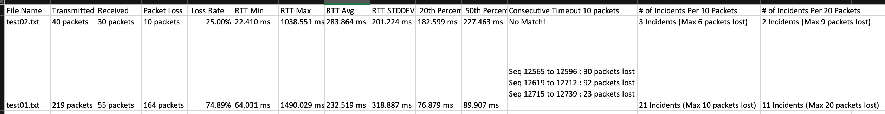
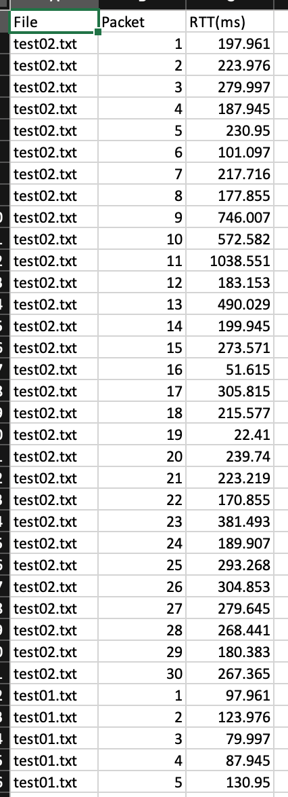
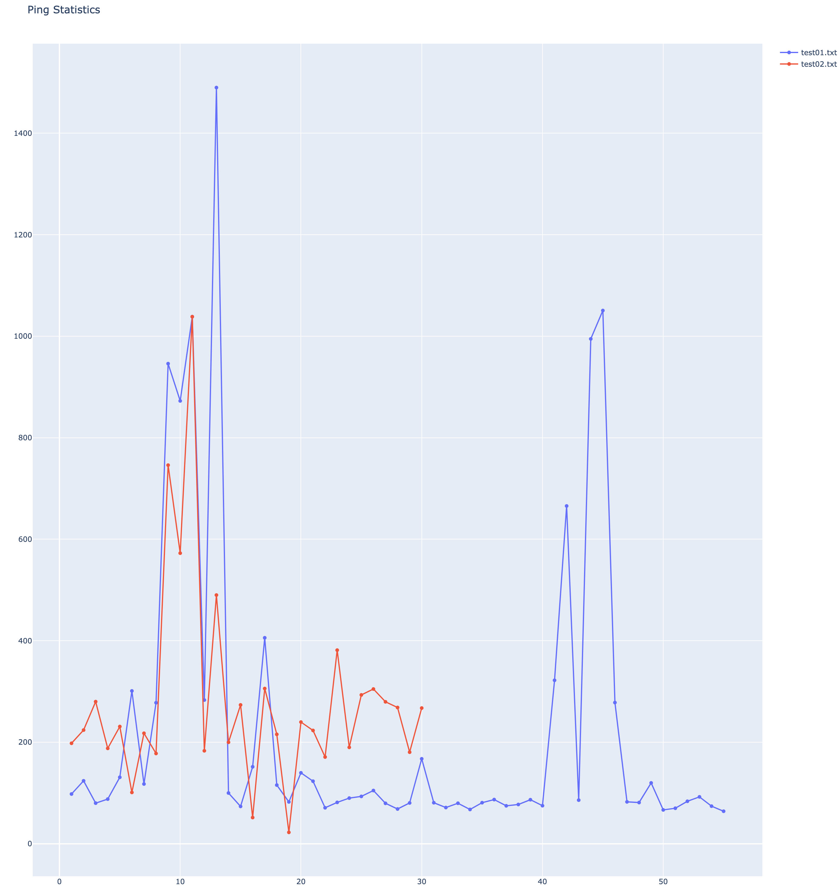
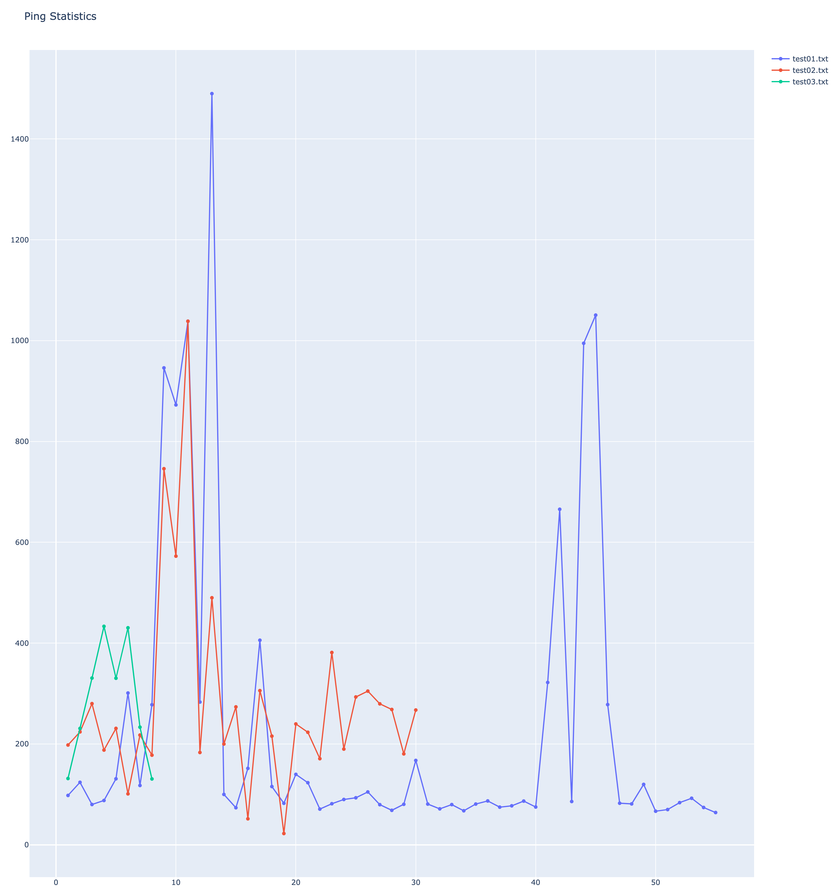

# ping_statistics.py - A tool to analyze ping output

## Introduction

### Features

#### Run As

```sh
$ ping_statistics.py filename1
$ ping_statistics.py filename1,filename2,filename3
```

1. Takes one or more filenames per default requirement.
2. Filenames are seperated by ','

#### Pakcets Counts & Round-Trip Time

    Display:
    1. number of packets transmitted 
    2. number of packets received
    3. number of packets lost
    4. percentage of packets loss
    5. min RTT
    6. avg RTT
    7. max RTT
    8. stddev (standard deviation) RTT
    The above result would be sent to STDOUT as default output.
  
#### Percentile Calculation (-p)

    1. Calculated percentile per requested values from STDIN.
    2. e.g. With '-p 10,20,30', it'd generate 10th, 20th, 30th percentiles. 
    3. Constraints: Input one or more integers between 0-100 that seperate the numbers by ','

#### Timeout Consecutively (-t)

    1. Display the number of lost packets for each requested consecutive timeout period.
    2. e.g. With '-t 5', it'd display the total lost-packet counts which is larger than 0 per 5 seconds (per 5 sequences).
    3. Input only one integer between 1 and the max packets of the input file.

#### Counts of Lost-Packets during a Time-Period (-c)

    1. Display the number of lost packets during the requested time period.
    2. e.g. With '-c 10,20', it'd show the number of lost packets for each time period.
    3. Input one or more integer values that seperate the numbers by ','
    4. The minimum value for the duration of time should be at least 1.
    5. The maximum value for the duration of time would be the max packets of the input file.

#### Convert one or more input ping-output file(s) to a CSV and a Graph (-g)

    1. Convert one or more input file(s) to a CSV file. (Default CSV filename: rtt.csv)
    2. Generate a graph for one of more input file(s). (Default Graph file: rtt.html)
    3. With '-g [name]' option, the default CSV and Graph would be replaced by [name].csv and [name].html.

#### Output the result to STDOUT and a CSV (-g)

    1. Output the result to STDOUT and write to a CSV file.  (Default output file: output.csv)
    2. With '-o [filename]' option, the default CSV would be replaced by filename.

### Notice
    1. Exclude the timed-out output that occurs before the 1st successful ping packet. 
       (As in test02.txt, ignore timeouts before line 7.)
    2. Exclude the timed-out output that occurs after the last successful ping packet. 
       (As in test02.txt, ignore timeouts before line 46.)        

# Instruction

## Install requirement

```console
% pip3 install -r requirements.txt
```

## Run with Help (-h):

```console
% python3 ping_statistics.py -h                                                  
usage: ping_statistics.py [-h] [-p PERCENTILES] [-t TIMEOUT] [-c COUNT] [-g GRAPH] [-o OUTPUT] filenames

Ping Statistics

positional arguments:
  filenames             Input the name of the file(s) that contain(s) the ping output, separated by ',' if more than one file.

optional arguments:
  -h, --help            show this help message and exit
  -t TIMEOUT, --timeout TIMEOUT
                        Input a single integer between 1 and the maximum number of packets in the input file for the maximum consecutive timeout.
  -p PERCENTILES, --percentiles PERCENTILES
                        Input value(s) (0-100), sepearted by ',' if there is more than one value.
  -c COUNT, --count COUNT
                        Input number(s) for the duration of time period, sepearted by ',' if more than one number
  -g GRAPH, --graph GRAPH
                        Input a name for the csv and the graph files (default is 'rtt' for rtt.csv and rtt.html
  -o OUTPUT, --output OUTPUT
                        Input the output filename (default is output.csv)
```

## Run As:

### Example 1: With 2 intput files, request 20th and 50th percentile,  10 second timeout period ,and per-10 and per-20 packets

1. Run As:

```console
% python3 ping_statistics.py test02.txt,test01.txt -p 20,50 -t 10 -c 10,20
------------------
 test02.txt 
------------------

 // Packet Counts //
 Transmitted       40 packets
 Received          30 packets
 Lost              10 packets
 Packet Loss Rate is 25.00%

 // Round-Trip Time //
 Round-trip min    =    22.410 ms
 Round-trip max    =  1038.551 ms
 Round-trip avg    =   283.864 ms
 Round-trip stddev =   201.224 ms

 // Percentiles //
 20th Percentile is   182.599 ms
 50th Percentile is   227.463 ms


 // Consecutive Timeouts //
[ No Match on Timeout Value: '10' ]

 // Lost-Packet Counts during a Time-Period //
Per 10 packets/seconds -- 
 Seq 12536 to 12545 lost 1 packets
 Seq 12546 to 12555 lost 3 packets
 Seq 12556 to 12565 lost 6 packets

Per 20 packets/seconds -- 
 Seq 12526 to 12545 lost 1 packets
 Seq 12546 to 12565 lost 9 packets

------------------
 test01.txt 
------------------

 // Packet Counts //
 Transmitted      219 packets
 Received          55 packets
 Lost             164 packets
 Packet Loss Rate is 74.89%

 // Round-Trip Time //
 Round-trip min    =    64.031 ms
 Round-trip max    =  1490.029 ms
 Round-trip avg    =   232.519 ms
 Round-trip stddev =   318.887 ms

 // Percentiles //
 20th Percentile is    76.879 ms
 50th Percentile is    89.907 ms


 // Consecutive Timeouts //
 Seq 12565 to 12596 :    30 packets lost
 Seq 12619 to 12712 :    92 packets lost
 Seq 12715 to 12739 :    23 packets lost


 // Lost-Packet Counts during a Time-Period //
Per 10 packets/seconds -- 
 Seq 12536 to 12545 lost 1 packets
 Seq 12546 to 12555 lost 3 packets
 Seq 12556 to 12565 lost 6 packets
 Seq 12566 to 12575 lost 10 packets
 Seq 12576 to 12585 lost 10 packets
 Seq 12586 to 12595 lost 10 packets
 Seq 12596 to 12605 lost 7 packets
 Seq 12606 to 12615 lost 2 packets
 Seq 12616 to 12625 lost 6 packets
 Seq 12626 to 12635 lost 10 packets
 Seq 12636 to 12645 lost 10 packets
 Seq 12646 to 12655 lost 10 packets
 Seq 12656 to 12665 lost 10 packets
 Seq 12666 to 12675 lost 10 packets
 Seq 12676 to 12685 lost 10 packets
 Seq 12686 to 12695 lost 10 packets
 Seq 12696 to 12705 lost 10 packets
 Seq 12706 to 12715 lost 6 packets
 Seq 12716 to 12725 lost 10 packets
 Seq 12726 to 12735 lost 10 packets
 Seq 12736 to 12744 lost 3 packets

Per 20 packets/seconds -- 
 Seq 12526 to 12545 lost 1 packets
 Seq 12546 to 12565 lost 9 packets
 Seq 12566 to 12585 lost 20 packets
 Seq 12586 to 12605 lost 17 packets
 Seq 12606 to 12625 lost 8 packets
 Seq 12626 to 12645 lost 20 packets
 Seq 12646 to 12665 lost 20 packets
 Seq 12666 to 12685 lost 20 packets
 Seq 12686 to 12705 lost 20 packets
 Seq 12706 to 12725 lost 16 packets
 Seq 12726 to 12744 lost 13 packets
```

2. **output.csv**



3. Partial of **rtt.csv**



4. **rtt.html**



### Example 2: With 3 intput files

1. Run As:

```console
% python3 ping_statistics.py test02.txt,test01.txt,test03.txt
------------------
 test02.txt 
------------------

 // Packet Counts //
 Transmitted       40 packets
 Received          30 packets
 Lost              10 packets
 Packet Loss Rate is 25.00%

 // Round-Trip Time //
 Round-trip min    =    22.410 ms
 Round-trip max    =  1038.551 ms
 Round-trip avg    =   283.864 ms
 Round-trip stddev =   201.224 ms
------------------
 test01.txt 
------------------

 // Packet Counts //
 Transmitted      219 packets
 Received          55 packets
 Lost             164 packets
 Packet Loss Rate is 74.89%

 // Round-Trip Time //
 Round-trip min    =    64.031 ms
 Round-trip max    =  1490.029 ms
 Round-trip avg    =   232.519 ms
 Round-trip stddev =   318.887 ms
------------------
 test03.txt 
------------------

 // Packet Counts //
 Transmitted        8 packets
 Received           8 packets
 Lost               0 packets
 Packet Loss Rate is  0.00%

 // Round-Trip Time //
 Round-trip min    =   130.662 ms
 Round-trip max    =   433.360 ms
 Round-trip avg    =   281.425 ms
 Round-trip stddev =   119.643 ms
```

2. ***rtt.html***


